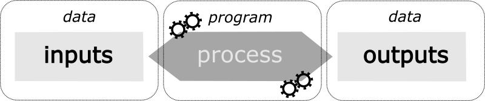
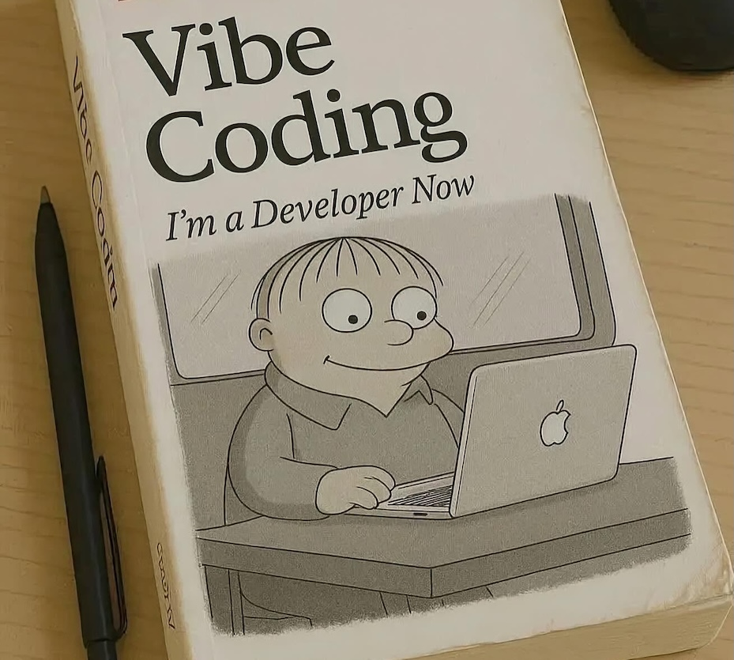
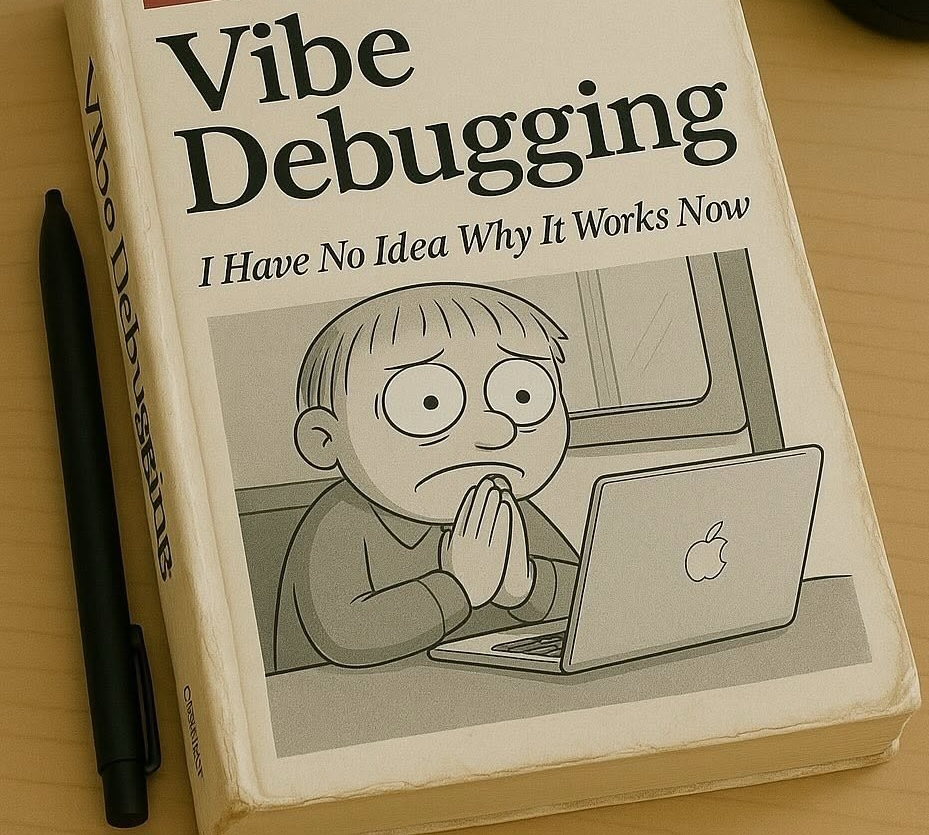

# What is Python?
What makes Python so appealing, useful, and flexible for scholarly research and textual analysis?\
Is it the best programming language?\
Better yet, does it even make sense to study programming in the age of AI?\

## Why code?

We use programming to solve computational problems or perform specific tasks (oftentimes repetitive or routine) by providing a computer with step-by-step instructions.

Communication between humans and computers is defined by I/O that stands for "input/output" and generally covers the broad spectrum of interfaces, peripherals and agents involved in this process, such as human operators, information processing systems, and AI agents.




::: {.callout-note title="I/O in different programming languages" collapse="true"} 

This [article](https://www.geeksforgeeks.org/dsa/input-and-output-in-programming/) gives a brief comparison of how different programming languages like C, JS, or Python handle input/output. You may notice that Python doesn't require a standalone library for that -- another testament to its popularity!

:::


## *Why* code manually?

Suffice it to say, LLMs are here to stay. The performance of frontier models improves constantly, and they excel at automating routine tasks, drafting boilerplates, and a vast range of generation tasks, such as summarisation, Q&A, or RAG.

The benchmarks below (courtesy of [Christopher Pollin](https://chpollin.github.io/), who talked about AI workflows at [MLDSE 2026 in Graz](https://dhgraz.github.io/dse-ml-2026/)) demonstrate three trends in the current snapshot of frontier LLM models.

**Growing capabilities**

Over the years, frontier LLMs have learnt to handle tasks with more advanced [computational complexity](https://en.wikipedia.org/wiki/Computational_complexity), as demonstrated on this chart prepared by the [METR (Model Evaluation and Threat Research)](https://metr.org/about) nonprofit community, who monitor frontier models performance (@fig-metr-time-horizons-log).

There is a steadily growing trend in task-completion time horizon, and the growth is even steeper on a linear scale (@fig-metr-time-horizons-lin).

::: {.panel-tabset group="os"}

### Log scale
, data as of 8 May 2026.](../images/metr_datavis_log.png){#fig-metr-time-horizons-log fig-alt="Scatter plot of AI models by release date from 2019 to 2026 against the length of task they complete with 50% success, on a log scale. Horizons rise from a few seconds for GPT-2 to over 16 hours for the most recent models."}

### Linear scale
, data as of 8 May 2026.](../images/metr_datavis_lin.png){#fig-metr-time-horizons-lin fig-alt="Scatter plot of AI models by release date from 2019 to 2026 against the length of task they complete with 50% success, on a linear scale. Horizons rise from a few seconds for GPT-2 to over 16 hours for the most recent models."}

:::

**Jagged capabilities**

Performance, however, is uneven. The same models that can work through software tasks lasting many hours still stumble on problems most people solve without effort. These results are often described as *jagged*: excellent at some tasks, surprisingly weak at closely related ones, with no reliable way to tell in advance which is which.

On SimpleBench (@fig-simplebench), a set of trick questions on everyday spatial, temporal and social reasoning, only the three best models have overtaken the average human baseline of 83.7%, and none comes close to the best human score of 95.4%.

The gap is wider still on ARC-AGI-3 (@fig-arc-agi), whose game-like environments are designed to be easy for humans to pick up: most systems score below 10%, and only a few approach human level, with a dedicated harness and at a cost of thousands of dollars. For us, this unevenness is the practical point: an AI assistant may solve one coding problem flawlessly and fail at the next without warning, so we need to be able to read, test and fix its code ourselves.


::: {.callout-note title="Jagged technology frontier"}

The term "jagged" was first introduced in [@dellacqua2023navigating], who define the concept of a "jagged technology frontier" to describe the uneven impact of GPT-4 models.

:::

::: {.panel-tabset}

### Everyday reasoning
, as of 2 October 2026.](../images/simple_bench_datavis.png){#fig-simplebench fig-alt="Leaderboard of the ten highest-scoring language models on SimpleBench, showing each model's average score as a percentage."}

### Unfamiliar tasks (AGI)
, as of 3 October 2026.](../images/arc-prize-leaderboard.png){#fig-arc-agi fig-alt="Scatter plot of ARC-AGI-3 scores from 0 to 100% against cost from $1 to $100K on a log scale. Most models score below 10%; GPT-6 Astra and GPT-6.1 Sol reach 80–100% with the Provider Adapter harness, at costs of several thousand dollars or more."}

:::

**Asymmetric amplification**

In his blogpost [@pollin2026asymmetric], Christopher Pollin argues that frontier models do not so much automate research as amplify computer-based research work, and that they do so unevenly:

> "Those who can judge quality, who understand their data and their domain, and who have access to frontier models and the infrastructure behind them, gain disproportionate leverage. Those who cannot are left behind." 

A model multiplies the skills its user already brings: where there are none, there is little to multiply. And since a model produces plausible text without checking it, someone still has to verify the result, or, as Pollin puts it, "without Computer Literacy, **the first error message is a dead end**." He describes three layers of competence that build on each other: *computer literacy*, *computational thinking*, and *informed vibe coding*, that is, working critically with a model on the basis of the first two. 

We will focus on the first two layers, so that the third becomes useful, controlled, and productive.

::: {layout-ncol=2}
{.nolightbox}

{.nolightbox}
:::

## *Why* Python?

**Beginner friendly**

As we will soon see, Python reads much like a natural, predicate-focused language with a small, strict grammar. Its vocabulary divides the way a linguist would expect: 

* there is a closed class of 35 *keywords*: logical operators and function words such as `and`, `or`, `not`, `if`, `for`, `in` and `return`, which you can neither redefine nor add to; 
* there is an open class of *names* that you coin yourself, such as `verse`, `lemma` or `word_count`;
* pre-defined functions behave like imperative verbs: `print()` displays what is to be printed as its argument, `open()` opens the file from your computer; 
* methods attach a verb to its subject, as in `'ΜΗΝΙΝ'.lower()`

```python
verse = 'arma virumque cano Troiae qui primus ab oris'
words = verse.split()
print(len(words))
```

Even without knowing any Python, you can probably guess that these three lines split a line of Virgil into words, count them, and print `8`. This is why Python is often called "executable pseudocode": the informal, half-English notation programmers use to sketch an algorithm is often not far from valid Python.

Learning the rules of Python is akin to learning a new languages - once you memorize basic syntax and some crucial 'keywords', you'll be able to communicate. Eloquence comes with learning formatting style conventions and abstract patterns to use them as building blocks when designing your programs.

::: {.callout-tip title="PEP8 in your step"}
There's a difference between grammatically correct English and eloquent, bedazzled, stylistically sound English. In the same vein, Python's style guide called [PEP 8](https://peps.python.org/pep-0008/) offers a trove of suggestions on improving your coding practices.

It rests on the observation that "code is read much more often than it is written", and the language's guiding aphorisms, [*The Zen of Python*](https://peps.python.org/pep-0020/), state it plainly: "Readability counts."

:::

::: {.callout-tip title="Zen of Python" collapse="true"}
```{python}
import this
```

:::

Like any grammar, Python's is unforgiving: a missing quotation mark or bracket is a `SyntaxError`. Unlike a reviewer, however, the interpreter tells you exactly where it stumbled, and learning to read these messages is a skill we will practice regularly throughout the course.

::: {.callout-note title="Coding in Latin? What?" collapse="true"}
There are plenty programming languages, whose syntax is written using other natural languages besides English. In fact, nothing prevents you from naming a Python variable in Greek or Latin -- just keep in mind that this code will be very difficult to evaluate for anyone else!

One example of a non-English programming language is [Lingua::Romana::Perligata](https://metacpan.org/release/DCONWAY/Lingua-Romana-Perligata-0.50/view/lib/Lingua/Romana/Perligata.pm), a a Perl 5 module that can be used to write functional code using a syntax based on classical Latin.

```perl
#! /usr/local/bin/perl -w
use Lingua::Romana::Perligata;

nexto stringum reperimentum da.     # $next = pos $string;
nextum stringo reperimento da.      # pos $string = $next;
inserto stringum tum unum tum duo excerpementum da.
                                    # $insert = substr($string,1,2);
insertum stringo unum tum duo excerpemento da.
                                    # substr($string,1,2) = $insert;
clavis hashus nominamentum da.      # @keys = keys %hash;
clava hashibus nominamento da.      # keys %hash = @keys;
```

:::

**High-level language**

Programming languages differ in how close they stay to the machine. *Low-level* languages, such as machine code, assembly and, to a degree, C, work in terms of the processor: memory addresses, bytes, registers. To count the words in a line of Virgil in C, you would reserve memory for the text, walk through it character by character, and decide yourself what counts as a space. *High-level* languages like Python hide these details behind abstractions such as *strings*, *lists* and *dictionaries*, so that you describe *what* you want rather than *how* the hardware should do it.

An editorial analogy: a low-level language is a diplomatic transcription, recording every abbreviation and letterform; a high-level language is the normalized reading text, which lets you concentrate on the meaning. Python also handles Unicode out of the box, so polytonic Greek needs no special treatment: 

```{python}
'Μῆνιν ἄειδε θεά'.split()
```

The price is speed: Python runs more slowly than C. For research, however, the scarce resource is usually our time, not the computer's.

**Easily accessible packages**

Python comes with "batteries included": its standard library already covers much of what this course needs, from `re` (regular expressions) and `unicodedata` (normalising Greek diacritics) to `xml.etree` (TEI files) and `csv` (tables). Beyond that, the [Python Package Index](https://pypi.org/) lists over 900,000 projects (as of October 2026), each installable with a single command.

Several of them were built for our source languages:

- [CLTK](https://cltk.org/), the Classical Language Toolkit: natural language processing for pre-modern languages, including Latin and Ancient Greek;
- [LatinCy](https://huggingface.co/latincy) and [odyCy](https://github.com/centre-for-humanities-computing/odyCy): pipelines for the widely used NLP library spaCy, for Latin and Ancient Greek respectively;
- [Stanza](https://stanfordnlp.github.io/stanza/): Stanford's NLP library, with models for Latin and Ancient Greek.

## History

Python began as a holiday project. In December 1989, Guido van Rossum, a programmer at the Centrum Wiskunde & Informatica (CWI) in Amsterdam, was looking for something to keep him busy over Christmas. He had helped build ABC, a teaching language developed at CWI, and Python took over several of its ideas, among them indentation as grammar and very high-level data types. The first public version, 0.9.0, followed in February 1991.

The name has nothing to do with reptiles. Van Rossum was reading the published scripts of *Monty Python's Flying Circus* and wanted a name that was "short, unique, and slightly mysterious". The official tutorial still [encourages references to the show](https://docs.python.org/3/tutorial/appetite.html), which is why example variables in Python documentation are so often called `spam` and `eggs`.

> By the way, the language is named after the BBC show “Monty Python’s Flying Circus” and has nothing to do with reptiles. Making references to Monty Python skits in documentation is not only allowed, it is encouraged!

In December 2008, Python 3.0 broke compatibility with earlier versions to fix old design flaws, and one fix was that all text became Unicode. In Python 2, a Greek word was by default a sequence of bytes: `len('Μῆνιν')` gave 11 instead of 5. The switch took more than a decade, and Python 2 reached its end of life on 1 January 2020.

Van Rossum stepped down as the language's ["Benevolent Dictator For Life"](https://en.wikipedia.org/wiki/Benevolent_dictator_for_life) in 2018. Since then, an elected Steering Council has guided Python's development, with a new version every October. This course uses Python 3.14.

::: {#py-versions}
](../images/py_ver_light.png){#fig-py-ver-light .light-content fig-alt="Python versions"}

](../images/py_ver_dark.png){#fig-py-ver-dark .dark-content fig-alt="Python versions"}

:::


## Concept check

*Coming soon.*

## Lab

*Coming soon.*

## Take-home extension

*Coming soon.*

## Further reading

*Coming soon.*
